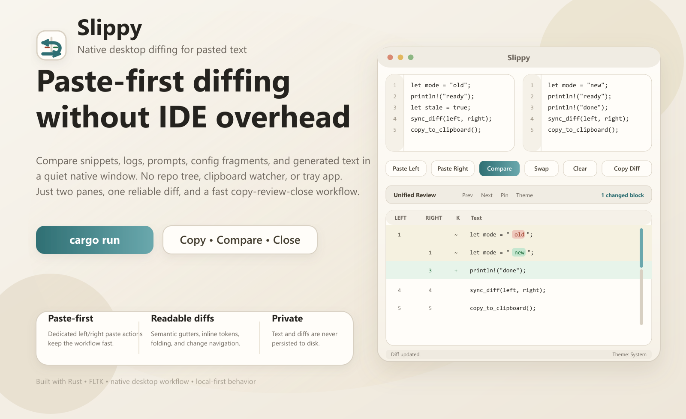

# Slippy

<p align="center">
  
</p>

<p align="center">
  <strong>A quiet, native desktop diff tool for pasted text.</strong>
</p>

<p align="center">
  Paste left. Paste right. Review the diff. Copy it. Close the window. No daemon, no tray app, no clipboard watcher.
</p>

<p align="center">
  <a href="https://github.com/wwwhynot3/slippy-diff/actions/workflows/release-please.yml">
    
  </a>
  <a href="https://github.com/wwwhynot3/slippy-diff/releases">
    
  </a>
  <a href="https://github.com/wwwhynot3/slippy-diff/blob/master/LICENSE">
    
  </a>
  
</p>

<p align="center">
  
</p>

---

## Overview

Slippy is a lightweight desktop utility for comparing two pasted text snippets. It is built for the everyday "I just need to check what changed" workflow: code blocks, config fragments, logs, prompts, generated text, shell output, or small document excerpts.

Unlike heavyweight diff tools, Slippy stays intentionally narrow:

- no repo view
- no file tree
- no background service
- no automatic clipboard reading
- no side-by-side merge UI

It is a small native scratchpad built with Rust and [`fltk-rs`](https://github.com/fltk-rs/fltk-rs).

## Table of Contents

- [Why Slippy](#why-slippy)
- [What It Looks Like](#what-it-looks-like)
- [Features](#features)
- [Quick Start](#quick-start)
- [Build Prerequisites](#build-prerequisites)
- [Keyboard Shortcuts](#keyboard-shortcuts)
- [Configuration](#configuration)
- [License](#license)
- [Architecture](#architecture)
- [Troubleshooting](#troubleshooting)
- [Known Issues](#known-issues)
- [Development](#development)
- [Roadmap Boundaries](#roadmap-boundaries)

## Why Slippy

### The workflow it optimizes for

```text
copy text A
copy text B
open Slippy
paste left
paste right
inspect the diff
copy the unified diff if needed
close Slippy
```

That is the entire product idea.

### Why not use a full diff tool?

Full diff tools are excellent when you want project context, files, history, or merge operations. They are overkill when you only want to compare two temporary snippets and move on.

Slippy is for the second case.

## What It Looks Like

### Main layout

```text
[ Left Input            ][ Right Input           ]
[ Paste Left | Paste Right | Compare | Swap | Clear | Copy Diff ]
[ Unified Review | Prev | Next | Pin | Theme | Summary ]
[ Read-only Diff Canvas                                 ]
[ Status Bar                                           ]
```

### High-level data flow

```text
edit or paste
   -> AppState marks diff dirty
   -> auto-diff if input is small enough
   -> worker computes structured diff
   -> stale results are ignored
   -> UI redraws diff canvas
   -> Copy Diff exports standard unified text
```

### Project identity assets

| Asset | Preview |
| --- | --- |
| App icon (SVG) |  |
| README hero | [`assets/readme/hero.svg`](assets/readme/hero.svg) and [`assets/readme/hero.png`](assets/readme/hero.png) |
| PNG set | `assets/icons/png/slippy-16.png` to `slippy-512.png` |

## Features

### Paste-first diff workflow

- Two editable panes with custom line-number gutters.
- Dedicated `Paste Left` and `Paste Right` actions.
- `Compare`, `Swap`, `Clear`, and `Copy Diff` centered around the primary workflow.

### Readable review-focused diff output

- Unified diff review pane with semantic old/new line-number gutters.
- Soft insert/delete row coloring.
- Neutral replacement blocks for paired edits.
- Inline token highlights for the exact changed fragments.
- Change overview rail for quick scanning.
- Adaptive folding for large unchanged regions.

### Native desktop behavior

- No daemon, tray icon, or background process.
- Pin toggle for always-on-top where the window manager supports it.
- System / Light / Dark theme support.
- Resizable layout with persisted split ratio and window metadata.

### Careful handling of larger inputs

- Debounced auto-diff for normal edits.
- Manual Compare mode for large input.
- Auto-diff is skipped when combined input exceeds:
  - `256 KiB`, or
  - `8,000` lines

### Privacy by design

- Slippy persists UI metadata only.
- Pasted text is never written to disk.
- Generated diff output is never written to disk.

## Quick Start

## Release & Download

Prebuilt artifacts are published on the GitHub releases page:

- [Latest release](https://github.com/wwwhynot3/slippy-diff/releases/latest)
- [All releases](https://github.com/wwwhynot3/slippy-diff/releases)

Current release automation builds these asset types:

- Linux binaries for `amd64` and `arm64`
- Linux AppImages for `x11` and `wayland`
- Windows binaries for `amd64` and `arm64`
- macOS binaries and DMG packages

If you do not see an asset for your platform yet, use the source build path below.

### Run from source

```bash
cargo run
```

### Run tests

```bash
cargo test
```

### Build a release binary

```bash
cargo build --release
```

### Optional Wayland build

```bash
cargo run --features wayland
```

## Build Prerequisites

Slippy bundles FLTK, but `fltk-rs` still requires a native C/C++ toolchain plus common desktop build libraries.

### Arch / CachyOS / Manjaro

```bash
sudo pacman -S --needed base-devel cmake git pkgconf \
  libx11 libxext libxft libxinerama libxcursor libxfixes libxrender \
  mesa glu pango fontconfig glib2 alsa-lib
```

### Debian / Ubuntu

```bash
sudo apt install build-essential cmake git pkg-config \
  libx11-dev libxext-dev libxft-dev libxinerama-dev libxcursor-dev libxfixes-dev libxrender-dev \
  libgl1-mesa-dev libglu1-mesa-dev libpango1.0-dev libfontconfig1-dev libglib2.0-dev libasound2-dev
```

### Fedora

```bash
sudo dnf install gcc gcc-c++ cmake git pkgconfig \
  libX11-devel libXext-devel libXft-devel libXinerama-devel libXcursor-devel libXfixes-devel libXrender-devel \
  mesa-libGL-devel mesa-libGLU-devel pango-devel fontconfig-devel glib2-devel alsa-lib-devel
```

### macOS

- Install Xcode command line tools: `xcode-select --install`
- Install CMake: `brew install cmake`

### Windows

- Install Visual Studio Build Tools with MSVC
- Install Git

Detailed public installer docs are intentionally out of scope for v1. For the full upstream dependency list, see the [`fltk-rs` dependency docs](https://github.com/fltk-rs/fltk-rs#dependencies).

## Keyboard Shortcuts

| Shortcut | Action |
| --- | --- |
| `Ctrl/Cmd+Enter` | Compare |
| `Ctrl/Cmd+L` | Paste Left |
| `Ctrl/Cmd+R` | Paste Right |
| `Ctrl/Cmd+Shift+S` | Swap |
| `Ctrl/Cmd+Shift+C` | Copy Diff |
| `Ctrl/Cmd+Shift+P` | Toggle Pin |
| `Ctrl/Cmd+Shift+↑` | Previous change |
| `Ctrl/Cmd+Shift+↓` | Next change |
| `Ctrl/Cmd+Shift+T` | Cycle theme |

FLTK maps `Cmd` on macOS and `Ctrl` on Linux/Windows through `Shortcut::Command`.

## Configuration

Slippy stores only window/layout/theme/font metadata in the OS config directory for app identity `dev.wwwhynot3.slippy` / `Slippy`.

### Persisted fields

- `width`
- `height`
- `vertical_split`
- `pinned`
- `theme`
- `ui_font`
- `mono_font`
- optional `diff` overrides

### Example config

```json
{
  "version": 1,
  "width": 1120,
  "height": 760,
  "vertical_split": 0.45,
  "pinned": false,
  "theme": "System",
  "ui_font": "",
  "mono_font": "",
  "diff": {
    "debounce_ms": 300,
    "auto_diff_max_bytes": 262144,
    "auto_diff_max_lines": 8000,
    "unified_context_radius": 3,
    "inline_max_changed_ratio": 0.35,
    "display_full_context_max_lines": 240,
    "similarity_pairing_max_lines": 120,
    "alignment_band": 40
  }
}
```

### Important privacy rule

Slippy does **not** serialize:

- pasted left text
- pasted right text
- rendered diff output
- copied unified diff text

If config is invalid or missing, Slippy falls back to defaults and keeps running.

## License

This repository is licensed under the MIT License.

- Full text: [LICENSE](LICENSE)
- GitHub badge at the top of this README now maps to the real license file in the repository

In practice, that means you can use, modify, and redistribute the code with the usual MIT terms and attribution requirement.

## Architecture

The codebase is deliberately layered:

```text
main.rs
  -> ui_fltk
      -> app_state
          -> diff_core

config
diff_view
```

### Modules

| Module | Responsibility |
| --- | --- |
| `src/diff_core.rs` | Pure diff logic, thresholds, structured diff operations |
| `src/app_state.rs` | UI-independent state machine, request ids, dirty/stale logic |
| `src/diff_view.rs` | Convert diff ops into rendered rows, gutters, folds, change marks |
| `src/ui_fltk.rs` | FLTK widgets, clipboard, timers, worker threads, shortcuts |
| `src/config.rs` | Persisted layout/theme/font metadata only |
| `src/main.rs` | Starts the application |

### Important invariant: stale workers must not win

Diffing runs on a fresh worker thread per request. There is no cancellation. Correctness depends on request ids and dirty-state checks, so an older computation must never overwrite a newer edit.

That invariant is one of the core reasons the app stays trustworthy.

## Troubleshooting

### Common `fltk-sys` build failures

- `cmake: command not found`
  - install `cmake`
- `pkg-config` or `pkgconf` missing
  - install the platform package
- missing `X11/Xlib.h` or "could not find X11"
  - install X11 development packages
- linker errors mentioning `GL` or `GLU`
  - install Mesa / OpenGL development packages
- Pango or fontconfig failures
  - install the corresponding development packages

### Wayland build notes

If you use:

```bash
cargo run --features wayland
```

you will also need Wayland-related system packages such as:

- `wayland`
- `wayland-protocols`
- `libxkbcommon`

If an `fltk-rs` release changes the Wayland feature spelling, only update the Cargo feature mapping in [`Cargo.toml`](Cargo.toml). No application code changes should be required.

## Known Issues

### KDE Plasma Wayland live-resize flicker

On at least one KDE Plasma Wayland setup, the window can briefly flash black during continuous manual resize, especially while shrinking the window.

Current evidence suggests this is in the FLTK top-level window / compositor live-resize path rather than in Slippy's diff canvas or layout logic. The repository includes [`examples/fltk_resize_probe.rs`](examples/fltk_resize_probe.rs) for isolating that behavior.

## Development

### Useful commands

```bash
cargo run
cargo test
cargo test diff_core
cargo test inline -- --nocapture
cargo fmt
cargo clippy --all-targets --all-features
cargo build --release
```

### Manual GUI smoke checklist

- App opens and closes with no background process.
- Paste buttons target the correct editor.
- Keyboard paste still works inside editors.
- Compare, Swap, Clear, and Copy Diff work.
- Diff row selection copies the rendered rows.
- Character-range selection copies only the selected characters.
- Auto-diff updates after normal edits.
- Large input switches to manual Compare behavior.
- Light and dark themes both keep insert/delete/replace states readable.
- Resize remains usable at small window sizes.

### Repository docs worth reading

- [AGENTS.md](AGENTS.md) for contributor guidance
- [CLAUDE.md](CLAUDE.md) for repo-specific implementation constraints
- [DESIGN.md](DESIGN.md) for product and visual direction
- [IMPLEMENTATION_PLAN.md](IMPLEMENTATION_PLAN.md) for behavior and test contract
- [TODOS.md](TODOS.md) for explicit out-of-scope or deferred work

## Roadmap Boundaries

### What v1 is

- a paste-first text diff scratchpad
- native desktop UI
- unified diff review
- privacy-conscious local tool

### What v1 is not

- file or directory diff
- merge or conflict resolution
- syntax highlighting IDE
- clipboard watcher
- background daemon
- tray app
- settings-heavy desktop suite
- public installer / app-store release pipeline

---

If you want a quiet diff tool that does one thing well, that is the bar Slippy is trying to hit.
